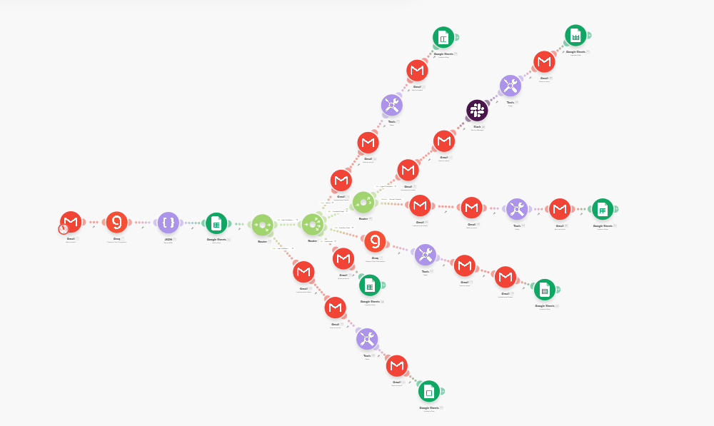
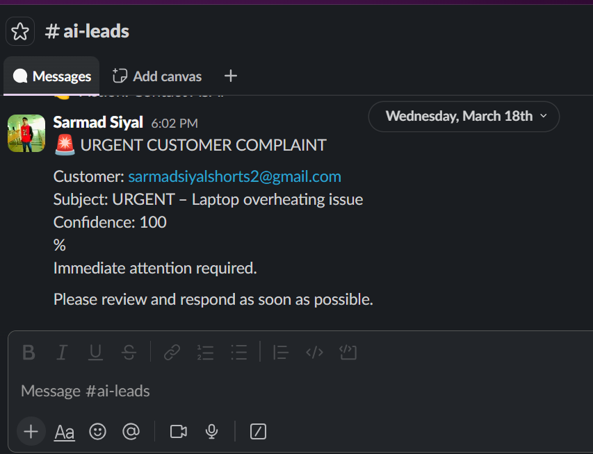
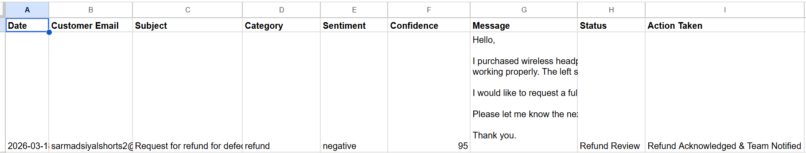

## AI-Powered Smart Email Customer Support & Escalation System
## 📌 Overview

This project is a production-ready AI-driven email automation system designed to intelligently classify, route, and escalate customer emails using AI-based decision logic.

The system reduces manual workload while ensuring safety through confidence thresholds and human-in-the-loop fallback.

## 🚀 Key Features
- AI-based email classification (Refund, Complaint, Question, Spam)
- Sentiment & urgency detection
- Confidence-based routing logic
- Human review fallback
- SLA timer for urgent complaints
- Slack escalation notifications
- Structured audit logging
- Risk-controlled automation
  
## 🏗 Architecture

- Gmail → AI (Groq LLaMA) → JSON Parser → Router → Logging → Escalation / Auto Reply

## 🛠 Tech Stack

- Make.com
- Gmail API
- Groq (LLaMA 3)
- Google Sheets (CRM Logging)
- Slack
- JSON Structured Parsing
  
## 📊 Business Impact
- 70–80% reduction in manual email handling
- Immediate escalation of urgent cases
- Structured audit tracking
- Improved response speed
- 
## 🖼 Screenshots

## 📂 Workflow File

- The exported automation blueprint is available inside:

- workflow/AI-Powered Smart Email Customer Support & Escalation System.json

- To use:

- 1. Download JSON file
- 2. Follow Setup Instructions
   
## ⚙ Setup Instructions
- Import workflow blueprint into Make.com
- Add Gmail connection
- Add Groq API key
- Configure Slack webhook
- Connect Google Sheets logging
- Run scenario
